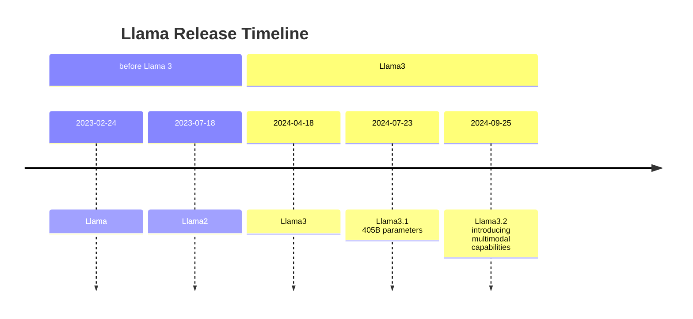

# Llama

[Llama](https://www.llama.com) is an open source large language model developed by Meta AI.

## Architecture of Llama

Llama is a transformer-based language model. It is trained on a large corpus of text, and can be used to generate text.

## Llama.cpp

[Llama.cpp](https://github.com/ggerganov/llama.cpp) is the C++ implementation of Meta's Llama. And now ggernanov build a ecosystem, including whisper.cpp, ggml and so on.

There are several folks who have implemented Llama in different languages. For example, [LLaMA-rs](https://github.com/onehr/llama-rs), [Llama.lean](https://github.com/bollu/llama.lean), and [Llama.jl](https://github.com/marcom/Llama.jl)
